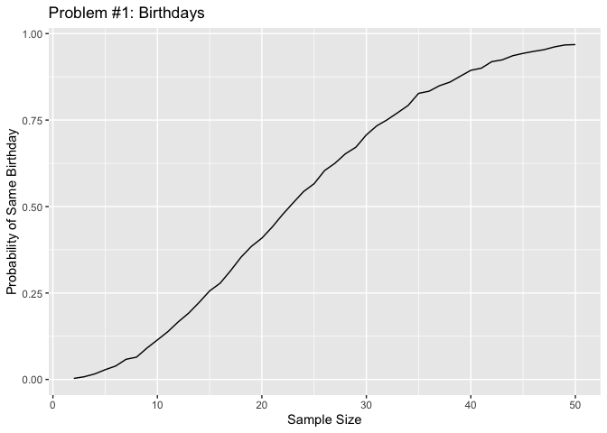

P8105 HW5
================
2024-11-09

## Problem 1

Creating function for birthdays.

``` r
birthdays_df <- expand_grid(
  group_size = 2:50,
  iter = 1:10000
)

check_duplicates <- function(n) {
  birthdays <- sample(1:365, n, replace = TRUE)
  any(duplicated(birthdays))
}

birthdays_df <- birthdays_df |> 
  mutate(duplicate = map(group_size, check_duplicates)) |> 
  unnest(duplicate) |> 
  group_by(group_size) |> 
  summarize(probability = mean(duplicate))
```

Visualizing the likelihood of two individuals with the same birthday.

``` r
ggplot(birthdays_df, aes(x = group_size, y = probability)) +
  geom_line() +
  labs(x = "Sample Size", y = "Probability of Same Birthday") +
  ggtitle("Problem #1: Birthdays") 
```

<!-- -->

This plot indicates that as the sample size increases, the probability
of two people sharing the same birthday increases. For example, if the
group has about 25 people, we can observe that there is over 50% chance
that two people will have the same birthday.
