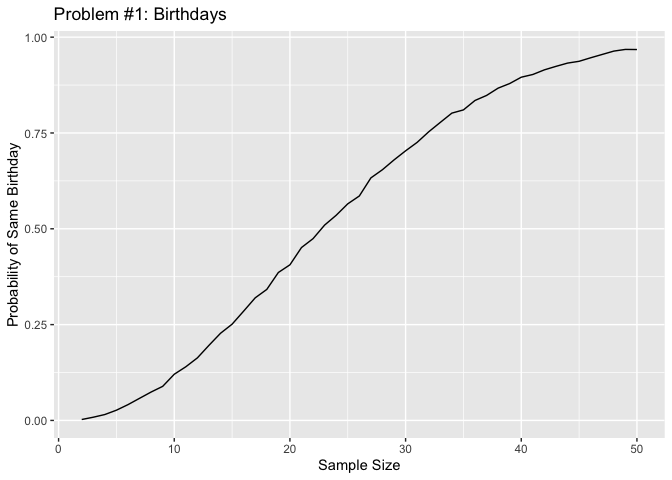
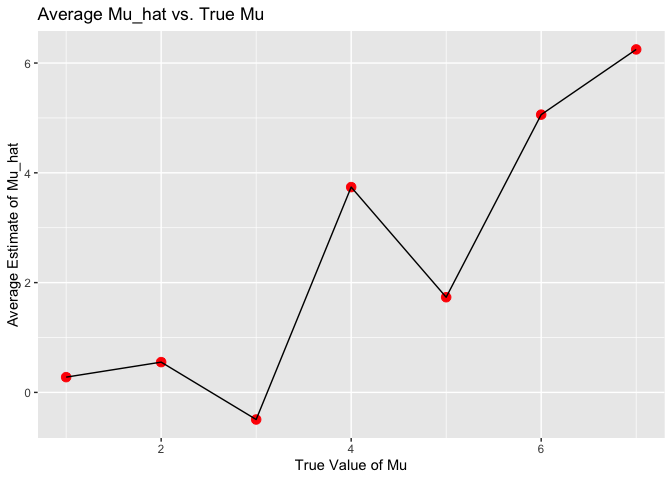

P8105 HW5
================
2024-11-09

## Problem 1

Creating function for birthdays.

``` r
birthdays_df <- expand_grid(
  group_size = 2:50,
  iter = 1:10000
)

check_duplicates <- function(n) {
  birthdays <- sample(1:365, n, replace = TRUE)
  any(duplicated(birthdays))
}

birthdays_df <- birthdays_df |> 
  mutate(duplicate = map(group_size, check_duplicates)) |> 
  unnest(duplicate) |> 
  group_by(group_size) |> 
  summarize(probability = mean(duplicate))
```

Visualizing the likelihood of two individuals with the same birthday.

``` r
ggplot(birthdays_df, aes(x = group_size, y = probability)) +
  geom_line() +
  labs(x = "Sample Size", y = "Probability of Same Birthday") +
  ggtitle("Problem #1: Birthdays") 
```

<!-- -->

This plot indicates that as the sample size increases, the probability
of two people sharing the same birthday increases. For example, if the
group has about 25 people, we can observe that there is over 50% chance
that two people will have the same birthday.

## Problem 2

``` r
n <- 30
sigma <- 5
mu_values <- c(0, 1, 2, 3, 4, 5, 6)
n_sims <- 5000
```

``` r
simulate_ttest <- function(mu = 0) {
  data <- tibble(x = rnorm(n, mean = mu, sd = sigma))
  ttest_result <- t.test(x~ 1, data = data)
  tidy(ttest_result) %>% 
    select(estimate, p.value) %>%
    mutate(mu = mu)
}
```

``` r
results_list <- map(mu_values, function(mu) {
  replicate(n_sims, simulate_ttest(mu), simplify = FALSE)
})
```

``` r
results_list <- lapply(results_list, as.data.frame)
```

``` r
results_df <- results_list %>%
  map_dfr(~ .x, .id = "mu") %>%
  mutate(mu = as.numeric(mu),
         rejected = p.value < 0.05)
```

``` r
power_df <- results_df %>%
  group_by(mu) %>%
  summarize(power = mean(rejected, na.rm = TRUE), .groups = "drop")
```

## Plot 1

``` r
ggplot(power_df, aes(x = mu, y = power)) +
  geom_point() +
  geom_line() +
  labs(x = "Mu", y = "Power") 
```

<!-- -->

From our analysis, we can observe that as the effect size increases, the
power of the test also increases. This means that as the true mean moves
further away from the hypothesis, the sample will also be further from
null value. Therefore, this indicates that we will reject the null
hypothesis.

``` r
average_estimates <- results_df %>% 
  group_by(mu) %>% 
  summarize(avg_estimate = mean(estimate))

rejected_estimates <- results_df %>% 
  filter(p.value < 0.05, mu >= 0, mu <= 6) %>%  
  group_by(mu) %>% 
  summarize(avg_estimate_rejected = mean(estimate))

combined_estimates <- left_join(average_estimates, rejected_estimates, by = "mu")
```

## Plot 2: Combined All Tests & Rejected

``` r
ggplot(combined_estimates, aes(x = mu)) +
  geom_point(aes(y = avg_estimate, color = "All")) +
  geom_point(aes(y = avg_estimate_rejected, color = "Rejected")) + 
  geom_line(aes(y = avg_estimate, color = "All"), na.rm = TRUE) + 
  geom_line(aes(y = avg_estimate_rejected, color = "Rejected"), na.rm = TRUE) +  
  labs(x = "Mu", y = "Average Estimate", color = "Test Type")
```

    ## Warning: Removed 2 rows containing missing values or values outside the scale range
    ## (`geom_point()`).

<!-- -->

This plot depicts two lines: the red line represents the average
estimate of 𝜇̂ (y) and the value of 𝜇(x). The blue line represents the
average estimate of 𝜇̂ in which the null was rejected (y) and the value
of 𝜇 (x).From this plot we can observe that all tests runs continuously
upward (overlapping the rejected line). However, the rejected showcases
avg estimate further away from zero.

## Plot 3: Average Mu_hat vs. True Mu

``` r
ggplot(average_estimates, aes(x = mu, y = avg_estimate)) +
  geom_point(alpha = 0.5) +
  stat_summary(fun = "mean", geom = "point", color = "red", size = 3) +
  geom_path() +
  labs(x = "True Value of Mu",
       y = "Average Estimate of Mu_hat",
       title = "Average Mu_hat vs. True Mu")
```

<!-- -->

This graph depicts average estimate of 𝜇̂ over 𝜇.

## Problem 3

Extracting the data. Making the city_state variable. To describe the raw
data, we can see that there are a lot of homicides spanning across the
US and a big discrepancy between closed/open cases with no arrest vs
arrest.

``` r
homicide_df <- read.csv("data/homicide-data.csv")

city_summary <- homicide_df %>% 
  mutate(city_state = paste(city, state, sep = ", ")) %>% 
  group_by(city_state) %>% 
  summarize(
    total_homicides = n(),
    unsolved_homicides = sum(disposition %in% c("Closed without arrest", "Open/No arrest"))
  )
```

Let’s examine Baltimore.

``` r
baltimore_test <- prop.test(
  x = city_summary %>% filter(city_state == "Baltimore, MD") %>% pull(unsolved_homicides),
  n = city_summary %>% filter(city_state == "Baltimore, MD") %>% pull(total_homicides)
)

baltimore_tidy <- broom::tidy(baltimore_test) %>% 
  select(estimate, conf.low, conf.high)
```

``` r
city_props <- city_summary %>% 
  mutate(
    prop_test_results = map2(unsolved_homicides, total_homicides, ~prop.test(.x, .y))
  ) %>% 
  mutate(tidy_results = map(prop_test_results, broom::tidy)) %>% 
  unnest(tidy_results) %>% 
  select(city_state, estimate, conf.low, conf.high)
```

    ## Warning: There was 1 warning in `mutate()`.
    ## ℹ In argument: `prop_test_results = map2(unsolved_homicides, total_homicides,
    ##   ~prop.test(.x, .y))`.
    ## Caused by warning in `prop.test()`:
    ## ! Chi-squared approximation may be incorrect

## Table of Findings for Each City

``` r
city_props %>%
  mutate(
    estimate = round(estimate, 3),
    conf.low = round(conf.low, 3),
    conf.high = round(conf.high, 3)
  ) %>%
  select(city_state, estimate, conf.low, conf.high) %>%
  kable(
    col.names = c("City,State", "Estimated Proportion", "Lower Confidence Interval", "Upper Confidence Interval"),
    caption = "Proportion of Unsolved Homicides by City/State"
  )
```

| City,State         | Estimated Proportion | Lower Confidence Interval | Upper Confidence Interval |
|:-------------------|---------------------:|--------------------------:|--------------------------:|
| Albuquerque, NM    |                0.386 |                     0.337 |                     0.438 |
| Atlanta, GA        |                0.383 |                     0.353 |                     0.415 |
| Baltimore, MD      |                0.646 |                     0.628 |                     0.663 |
| Baton Rouge, LA    |                0.462 |                     0.414 |                     0.511 |
| Birmingham, AL     |                0.434 |                     0.399 |                     0.469 |
| Boston, MA         |                0.505 |                     0.465 |                     0.545 |
| Buffalo, NY        |                0.612 |                     0.569 |                     0.654 |
| Charlotte, NC      |                0.300 |                     0.266 |                     0.336 |
| Chicago, IL        |                0.736 |                     0.724 |                     0.747 |
| Cincinnati, OH     |                0.445 |                     0.408 |                     0.483 |
| Columbus, OH       |                0.530 |                     0.500 |                     0.560 |
| Dallas, TX         |                0.481 |                     0.456 |                     0.506 |
| Denver, CO         |                0.542 |                     0.485 |                     0.598 |
| Detroit, MI        |                0.588 |                     0.569 |                     0.608 |
| Durham, NC         |                0.366 |                     0.310 |                     0.426 |
| Fort Worth, TX     |                0.464 |                     0.422 |                     0.507 |
| Fresno, CA         |                0.347 |                     0.305 |                     0.391 |
| Houston, TX        |                0.507 |                     0.489 |                     0.526 |
| Indianapolis, IN   |                0.449 |                     0.422 |                     0.477 |
| Jacksonville, FL   |                0.511 |                     0.482 |                     0.540 |
| Kansas City, MO    |                0.408 |                     0.380 |                     0.437 |
| Las Vegas, NV      |                0.414 |                     0.388 |                     0.441 |
| Long Beach, CA     |                0.413 |                     0.363 |                     0.464 |
| Los Angeles, CA    |                0.490 |                     0.469 |                     0.511 |
| Louisville, KY     |                0.453 |                     0.412 |                     0.495 |
| Memphis, TN        |                0.319 |                     0.296 |                     0.343 |
| Miami, FL          |                0.605 |                     0.569 |                     0.640 |
| Milwaukee, wI      |                0.361 |                     0.333 |                     0.391 |
| Minneapolis, MN    |                0.511 |                     0.459 |                     0.563 |
| Nashville, TN      |                0.362 |                     0.329 |                     0.398 |
| New Orleans, LA    |                0.649 |                     0.623 |                     0.673 |
| New York, NY       |                0.388 |                     0.349 |                     0.427 |
| Oakland, CA        |                0.536 |                     0.504 |                     0.569 |
| Oklahoma City, OK  |                0.485 |                     0.447 |                     0.524 |
| Omaha, NE          |                0.413 |                     0.365 |                     0.463 |
| Philadelphia, PA   |                0.448 |                     0.430 |                     0.466 |
| Phoenix, AZ        |                0.551 |                     0.518 |                     0.584 |
| Pittsburgh, PA     |                0.534 |                     0.494 |                     0.573 |
| Richmond, VA       |                0.263 |                     0.223 |                     0.308 |
| Sacramento, CA     |                0.370 |                     0.321 |                     0.421 |
| San Antonio, TX    |                0.429 |                     0.395 |                     0.463 |
| San Bernardino, CA |                0.618 |                     0.558 |                     0.675 |
| San Diego, CA      |                0.380 |                     0.335 |                     0.426 |
| San Francisco, CA  |                0.507 |                     0.468 |                     0.545 |
| Savannah, GA       |                0.467 |                     0.404 |                     0.532 |
| St. Louis, MO      |                0.540 |                     0.515 |                     0.564 |
| Stockton, CA       |                0.599 |                     0.552 |                     0.645 |
| Tampa, FL          |                0.457 |                     0.388 |                     0.527 |
| Tulsa, AL          |                0.000 |                     0.000 |                     0.945 |
| Tulsa, OK          |                0.331 |                     0.293 |                     0.371 |
| Washington, DC     |                0.438 |                     0.411 |                     0.465 |

Proportion of Unsolved Homicides by City/State

``` r
city_props %>% 
  mutate(city_state = fct_reorder(city_state, estimate)) %>% 
  ggplot(aes(x = city_state, y = estimate)) +
  geom_point() +
  geom_errorbar(aes(ymin = conf.low, ymax = conf.high)) +
  labs(x = "City/ State", y = "Proportion of Unsolved Homicides") +
  theme(axis.text.x = element_text(angle = 90, hjust = 1))
```

<!-- -->
